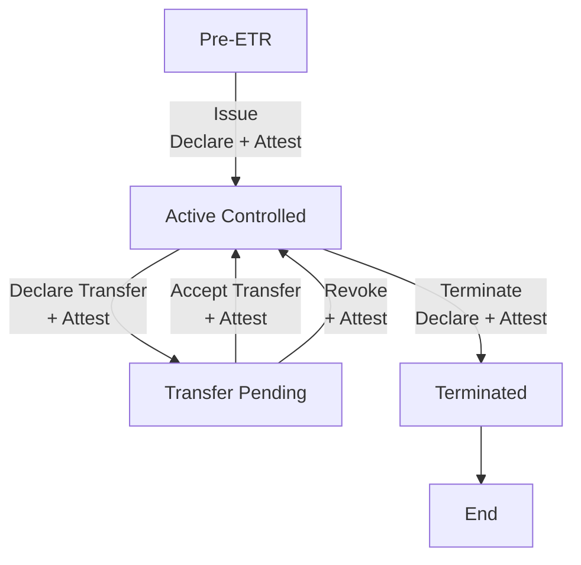

# State Transition

```mermaid
flowchart TD

    A[Pre-ETR] -->|Issue<br>Declare + Attest| B[Active Controlled]

    B -->|Declare Transfer<br>+ Attest| C[Transfer Pending]

    C -->|Accept Transfer<br>+ Attest| B

    C -->|Revoke<br>+ Attest| B

    B -->|Terminate<br>Declare + Attest| D[Terminated]

    D --> E[End]
```